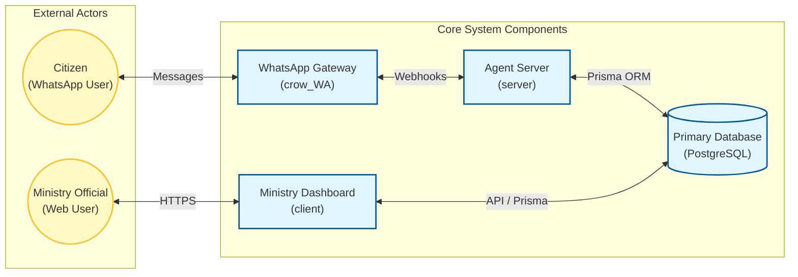
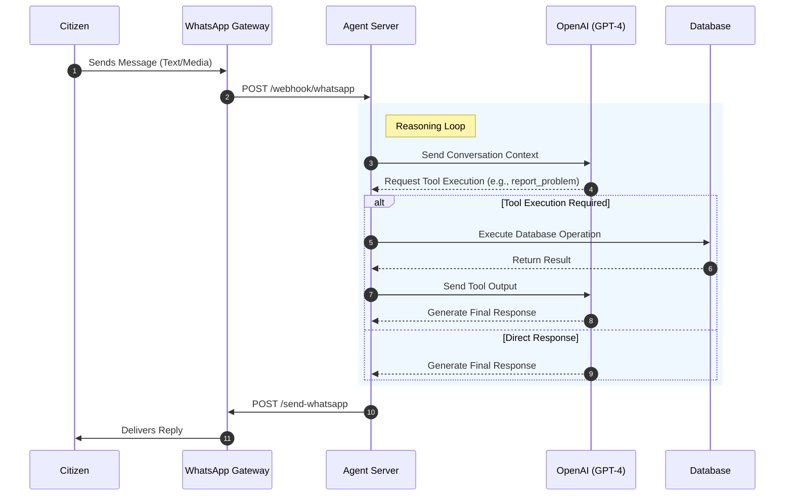
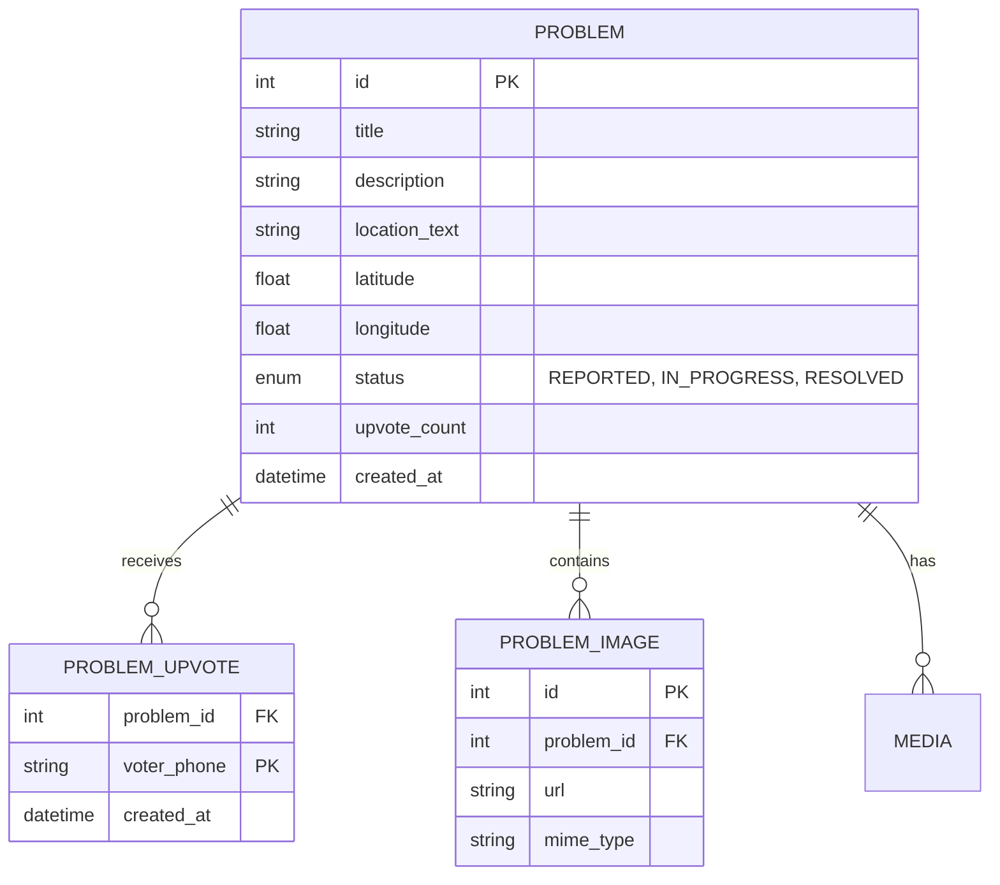

# Complain Bot Platform Architecture

**Version:** 1.0.0
**Status:** Active

---

## 1. Executive Summary

The **Complain Bot Platform** is a civic engagement system designed to bridge the gap between citizens and local authorities in Sierra Leone. It leverages WhatsApp for accessible reporting and a modern web dashboard for administrative oversight. The system is architected as a set of loosely coupled services to ensure scalability, maintainability, and ease of deployment.

## 2. High-Level System Context

The following diagram illustrates the high-level interaction between the primary actors and system components.

## 3. Component Specifications

The system is divided into three distinct functional units.

### 3.1 WhatsApp Gateway (`crow_WA`)

| Feature | Description |
| :--- | :--- |
| **Role** | Connectivity Layer |
| **Technology** | Node.js, `whatsapp-web.js`, Docker |
| **Responsibility** | Manages the connection to the WhatsApp network, handles QR code authentication, and forwards incoming messages to the Agent Server. |
| **Key Endpoints** | `POST /send-whatsapp`, `POST /webhook/whatsapp` |

### 3.2 Agent Server (`server`)

| Feature | Description |
| :--- | :--- |
| **Role** | Intelligence & Business Logic |
| **Technology** | Node.js, Express, OpenAI GPT-4, Prisma |
| **Responsibility** | Processes incoming messages, determines intent (Report, Upvote, Help), executes business logic via tools, and generates intelligent responses. |
| **Key Components** | `Complain BotAgent` (Orchestrator), `OpenAI` (Reasoning), `Tools` (Actions) |

### 3.3 Web Client (`client`)

| Feature | Description |
| :--- | :--- |
| **Role** | Visualization & Administration |
| **Technology** | Next.js 16, React, Tailwind CSS |
| **Responsibility** | Provides a public-facing view of community issues and a secured dashboard for ministry officials to manage and update problem status. |
| **Data Access** | **Public**: Server Components (Direct DB)   **Admin**: Client Components (API) |

## 4. Agent Logic & Data Flow

The Agent Server employs a reasoning loop to process complex user inputs.

## 5. Data Model (ERD)

The database schema is designed to support the core entities of the platform: Problems, Upvotes, and Media.

---
*Confidential - Internal Use Only*
